Remote sensing of Mountain pine beetle outbreaks; Darkwoods Conservation
Area
================
SMurphy
2020-11-02

- [1. Model Designs](#1-model-designs)
  - [1.1 Import Data](#11-import-data)
  - [1.2 Model Slope](#12-model-slope)
  - [1.3 Model Training](#13-model-training)
  - [1.4 Model Tuning](#14-model-tuning)
  - [1.5 Model Validation](#15-model-validation)
- [2. Full Model List](#2-full-model-list)
- [3. Appendix: Seperability Analysis of Spectral Bands &
  Indices](#3-appendix-seperability-analysis-of-spectral-bands--indices)

## 1. Model Designs

### 1.1 Import Data

Set seeds to `123`. Import excel data representing training data of
red-stage beetle attacks from candidate spectral indices sample in-field
in forest health surveys.

``` r
set.seed(123)
darkwoods_beetle_plots_data <- read_excel("2.1.darkwoods_beetle_ground_plots.xlsx")
print(darkwoods_beetle_plots_data)
```

    # A tibble: 28 × 7
        plot pi_mpb_killed pi_mpb_killed_pc   ndmi taswet tasgre tasbri
       <dbl>         <dbl>            <dbl>  <dbl>  <dbl>  <dbl>  <dbl>
     1    26          47.4             75.4 -0.166 -3653.  8290. 15922.
     2    27          44.8             77.9 -0.163 -3627.  8214. 15823.
     3    19          42.3             80.3 -0.156 -4057.  8474. 16402.
     4     2          39.8             80.7 -0.153 -3478.  8063. 15531.
     5     3          37.2             80.7 -0.152 -3576.  8188. 15796.
     6    17          34.7             81.3 -0.140 -4135.  8744. 16855.
     7    20          32.1             81.5 -0.139 -4821.  9452. 18099.
     8    22          29.6             81.7 -0.138 -4460.  8701. 16967.
     9    21          27.1             82.4 -0.133 -4374.  8755. 17018.
    10    18          26.8             82.5 -0.131 -5081.  9102. 17824.
    # ℹ 18 more rows

### 1.2 Model Slope

``` r
beetle_ndmi <- lm(pi_mpb_killed_pc ~ ndmi, data = darkwoods_beetle_plots_data)
beetle_ndmi_residuals <- resid(beetle_ndmi)
summary(beetle_ndmi)
```


    Call:
    lm(formula = pi_mpb_killed_pc ~ ndmi, data = darkwoods_beetle_plots_data)

    Residuals:
        Min      1Q  Median      3Q     Max 
    -6.7582 -1.5253  0.5376  2.0439  3.0846 

    Coefficients:
                Estimate Std. Error t value Pr(>|t|)    
    (Intercept)  100.470      1.431   70.20  < 2e-16 ***
    ndmi         124.421     11.695   10.64 5.75e-11 ***
    ---
    Signif. codes:  0 '***' 0.001 '**' 0.01 '*' 0.05 '.' 0.1 ' ' 1

    Residual standard error: 2.384 on 26 degrees of freedom
    Multiple R-squared:  0.8132,    Adjusted R-squared:  0.806 
    F-statistic: 113.2 on 1 and 26 DF,  p-value: 5.75e-11

``` r
plot(pi_mpb_killed_pc ~ ndmi, data = darkwoods_beetle_plots_data,
    main = NULL, ylab = "Percent of basal area of pine trees killed by MPB",
    xlab = "NDMI", col = "blue") + abline(lm(pi_mpb_killed_pc ~
    ndmi, data = darkwoods_beetle_plots_data), col = "red")
```

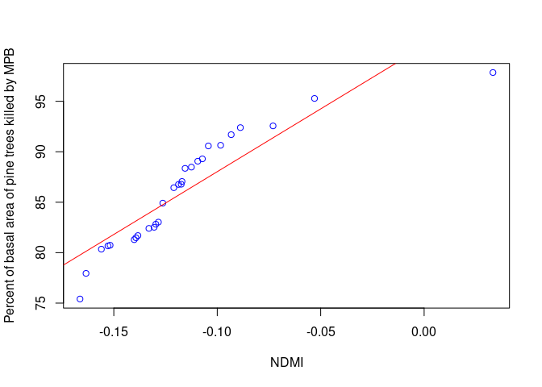<!-- -->

    integer(0)

### 1.3 Model Training

Splitting data 70:30 for training samples based on outcome variable:
`pi_mpb_killed_pc`.

``` r
beetle_training.samples <- createDataPartition(darkwoods_beetle_plots_data$pi_mpb_killed,
    p = 0.7, list = FALSE)
beetle_train.data <- darkwoods_beetle_plots_data[beetle_training.samples,
    ]
beetle_test.data <- darkwoods_beetle_plots_data[-beetle_training.samples,
    ]
```

Training regimes set with `time-slice` grid and 10K-fold cross
validation with 10 repeats using `repeatedcv` function.

``` r
model_training_time_series <- trainControl(method = "timeslice",
    initialWindow = 36, horizon = 12, fixedWindow = TRUE)

model_training_10kfold <- trainControl(method = "repeatedcv",
    number = 10, repeats = 10)
# animation of 10-kfold method:
animation::cv.ani(k = 10)
```

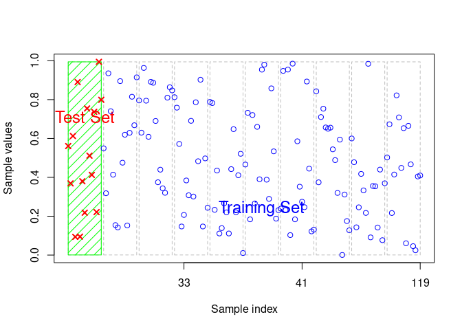<!-- -->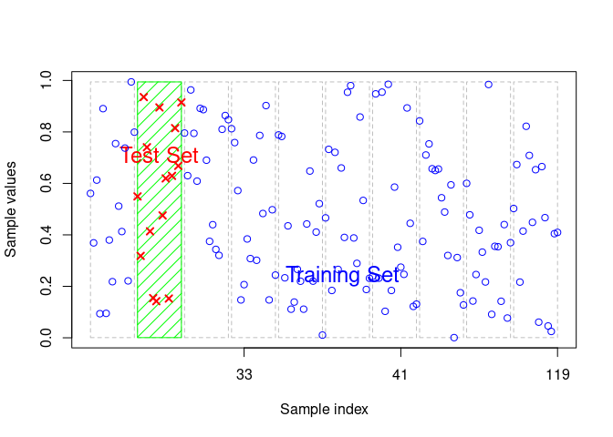<!-- -->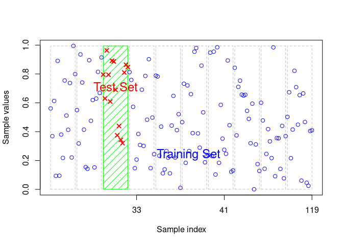<!-- -->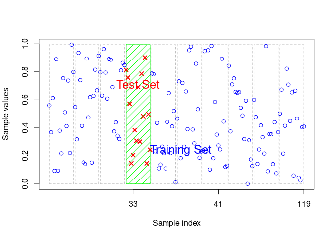<!-- -->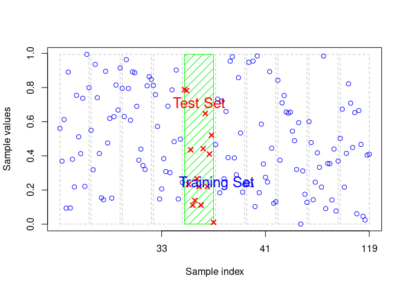<!-- -->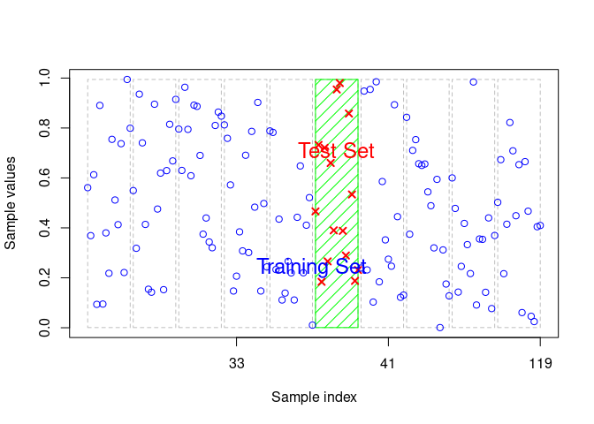<!-- -->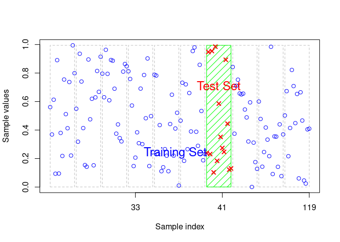<!-- -->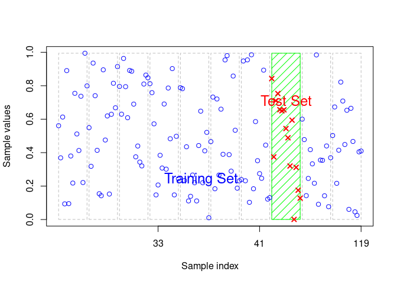<!-- -->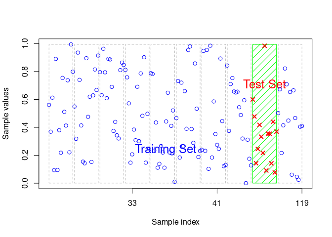<!-- -->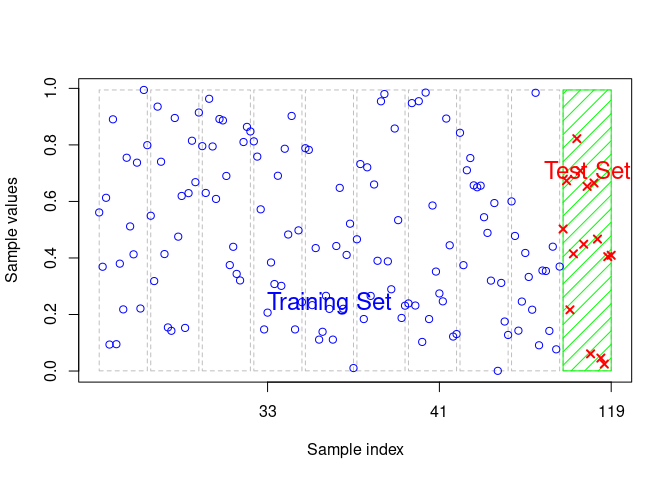<!-- -->

### 1.4 Model Tuning

Models are fitted with the `svmLinear` support vector machine linear
kernel and tuned with 3-step tuning grid and maximum of 20
hyperparameters. Data preprocessing included using `center` and `scale`
functions.

``` r
# model 1 - NDMI - model specification
svm_ndmi_linear <- train(pi_mpb_killed ~ ndmi, data = beetle_train.data,
    method = "svmLinear", trControl = model_training_10kfold,
    preProcess = c("center", "scale"), tuneLength = 10)

svm_ndmi_radial <- train(pi_mpb_killed ~ ndmi, data = beetle_train.data,
    method = "svmRadial", trControl = model_training_10kfold,
    preProcess = c("center", "scale"), tuneLength = 10)

rf_ndmi_1000trees = train(pi_mpb_killed ~ ndmi, data = beetle_train.data,
    method = "rf", ntree = 1000, metric = "RMSE", trControl = model_training_10kfold,
    importance = TRUE)
```

### 1.5 Model Validation

``` r
# model 4 - results
beetle_ndmi_pred_train <- predict(svm_ndmi_linear, data = beetle_train.data)
beetle_ndmi_pred_train_mae <- mae(beetle_ndmi_pred_train, beetle_train.data$pi_mpb_killed)
beetle_ndmi_pred_train_mae
```

    [1] 7.931194

``` r
beetle_ndmi_pred_train_mae_rel <- (beetle_ndmi_pred_train_mae/mean(beetle_train.data$pi_mpb_killed)) *
    100
beetle_ndmi_pred_train_mae_rel
```

    [1] 43.4615

``` r
beetle_ndmi_pred_train_rmse <- rmse(beetle_ndmi_pred_train, beetle_train.data$pi_mpb_killed)
beetle_ndmi_pred_train_rmse
```

    [1] 14.48146

``` r
beetle_ndmi_pred_train_rmse_rel <- (beetle_ndmi_pred_train_rmse/mean(beetle_train.data$pi_mpb_killed)) *
    100
beetle_ndmi_pred_train_rmse_rel
```

    [1] 79.35573

``` r
beetle_ndmi_pred_train_R2 <- R2(beetle_ndmi_pred_train, beetle_train.data$pi_mpb_killed)
beetle_ndmi_pred_train_R2
```

    [1] 0.556276

``` r
TheilU(beetle_train.data$pi_mpb_killed, beetle_ndmi_pred_train,
    type = 2)
```

    [1] 0.6118121

``` r
beetle_ndmi_pred_train_Ubias <- ((beetle_ndmi_pred_train_mae) *
    20)/((beetle_ndmi_pred_train_mae)^2)
beetle_ndmi_pred_train_Ubias
```

    [1] 2.521688

``` r
beetle_ndmi_pred_test <- predict(svm_ndmi_linear, data = darkwoods_beetle_plots_data)
beetle_ndmi_pred_test_rmse <- rmse(beetle_ndmi_pred_test, darkwoods_beetle_plots_data$pi_mpb_killed)
beetle_ndmi_pred_test_rmse/beetle_ndmi_pred_train_rmse
```

    [1] 1.131899

## 2. Full Model List

``` r
# model 2 - TAS-WET - model specification
svm_taswet_linear <- train(pi_mpb_killed ~ taswet, data = beetle_train.data,
    method = "svmLinear", trControl = model_training_10kfold,
    preProcess = c("center", "scale"), tuneGrid = expand.grid(C = seq(0,
        3, length = 20)))

# model 3 - TAS-GRE - model specification
svm_tasgreen_linear <- train(pi_mpb_killed ~ tasgre, data = beetle_train.data,
    method = "svmLinear", trControl = model_training_10kfold,
    preProcess = c("center", "scale"), tuneGrid = expand.grid(C = seq(0,
        3, length = 20)))

# model 4 - TAS-BRI - model specification
svm_tasbright_linear <- train(pi_mpb_killed ~ tasbri, data = beetle_train.data,
    method = "svmLinear", trControl = model_training_10kfold,
    preProcess = c("center", "scale"), tuneGrid = expand.grid(C = seq(0,
        3, length = 20)))

# model 1 results
svm_ndmi_linear
```

    Support Vector Machines with Linear Kernel 

    20 samples
     1 predictor

    Pre-processing: centered (1), scaled (1) 
    Resampling: Cross-Validated (10 fold, repeated 10 times) 
    Summary of sample sizes: 18, 18, 18, 18, 18, 18, ... 
    Resampling results:

      RMSE      Rsquared  MAE     
      14.69891  1         12.84142

    Tuning parameter 'C' was held constant at a value of 1

``` r
svm_ndmi_linear$finalModel
```

    Support Vector Machine object of class "ksvm" 

    SV type: eps-svr  (regression) 
     parameter : epsilon = 0.1  cost C = 1 

    Linear (vanilla) kernel function. 

    Number of Support Vectors : 20 

    Objective Function Value : -9.2667 
    Training error : 0.876724 

``` r
trellis.par.set(caretTheme())
densityplot(svm_ndmi_linear)
```

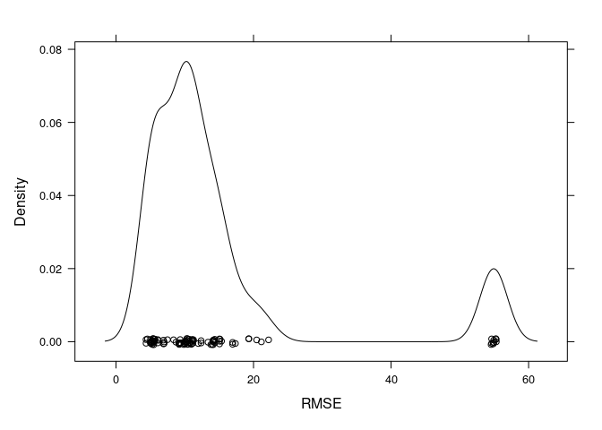<!-- -->

``` r
# model 2 results
svm_taswet_linear$finalModel
```

    Support Vector Machine object of class "ksvm" 

    SV type: eps-svr  (regression) 
     parameter : epsilon = 0.1  cost C = 3 

    Linear (vanilla) kernel function. 

    Number of Support Vectors : 19 

    Objective Function Value : -39.3525 
    Training error : 1.103527 

``` r
trellis.par.set(caretTheme())
densityplot(svm_taswet_linear)
```

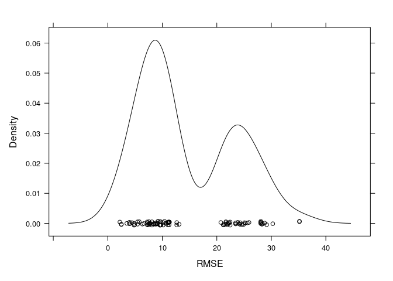<!-- -->

``` r
# model 3 results
svm_tasgreen_linear
```

    Support Vector Machines with Linear Kernel 

    20 samples
     1 predictor

    Pre-processing: centered (1), scaled (1) 
    Resampling: Cross-Validated (10 fold, repeated 10 times) 
    Summary of sample sizes: 18, 18, 18, 18, 18, 18, ... 
    Resampling results across tuning parameters:

      C          RMSE      Rsquared  MAE     
      0.0000000       NaN  NaN            NaN
      0.1578947  14.90197    1       12.86992
      0.3157895  14.77472    1       12.80648
      0.4736842  14.70217    1       12.76627
      0.6315789  14.65575    1       12.72341
      0.7894737  14.60836    1       12.68705
      0.9473684  14.58204    1       12.64617
      1.1052632  14.56585    1       12.62416
      1.2631579  14.55356    1       12.60746
      1.4210526  14.52967    1       12.58102
      1.5789474  14.51433    1       12.56374
      1.7368421  14.50950    1       12.55841
      1.8947368  14.50782    1       12.55475
      2.0526316  14.50454    1       12.55124
      2.2105263  14.50751    1       12.54916
      2.3684211  14.51457    1       12.54999
      2.5263158  14.52341    1       12.55346
      2.6842105  14.52609    1       12.55586
      2.8421053  14.52776    1       12.55606
      3.0000000  14.52750    1       12.55564

    RMSE was used to select the optimal model using the smallest value.
    The final value used for the model was C = 2.052632.

``` r
svm_tasgreen_linear$finalModel
```

    Support Vector Machine object of class "ksvm" 

    SV type: eps-svr  (regression) 
     parameter : epsilon = 0.1  cost C = 2.05263157894737 

    Linear (vanilla) kernel function. 

    Number of Support Vectors : 19 

    Objective Function Value : -26.9466 
    Training error : 1.131827 

``` r
trellis.par.set(caretTheme())
densityplot(svm_tasgreen_linear)
```

<!-- -->

``` r
# model 4 results
svm_tasbright_linear
```

    Support Vector Machines with Linear Kernel 

    20 samples
     1 predictor

    Pre-processing: centered (1), scaled (1) 
    Resampling: Cross-Validated (10 fold, repeated 10 times) 
    Summary of sample sizes: 18, 18, 18, 18, 18, 18, ... 
    Resampling results across tuning parameters:

      C          RMSE      Rsquared  MAE     
      0.0000000       NaN  NaN            NaN
      0.1578947  14.99098    1       12.99043
      0.3157895  14.79765    1       12.86416
      0.4736842  14.74247    1       12.84075
      0.6315789  14.76346    1       12.86317
      0.7894737  14.78402    1       12.88477
      0.9473684  14.78283    1       12.88239
      1.1052632  14.77783    1       12.87731
      1.2631579  14.77431    1       12.87459
      1.4210526  14.78552    1       12.87912
      1.5789474  14.78877    1       12.88261
      1.7368421  14.78871    1       12.88253
      1.8947368  14.78872    1       12.88256
      2.0526316  14.78306    1       12.87925
      2.2105263  14.77945    1       12.87443
      2.3684211  14.76153    1       12.86962
      2.5263158  14.75282    1       12.86474
      2.6842105  14.74776    1       12.85998
      2.8421053  14.73937    1       12.85519
      3.0000000  14.73953    1       12.85594

    RMSE was used to select the optimal model using the smallest value.
    The final value used for the model was C = 2.842105.

``` r
svm_tasbright_linear$finalModel
```

    Support Vector Machine object of class "ksvm" 

    SV type: eps-svr  (regression) 
     parameter : epsilon = 0.1  cost C = 2.84210526315789 

    Linear (vanilla) kernel function. 

    Number of Support Vectors : 19 

    Objective Function Value : -37.5788 
    Training error : 1.120976 

``` r
trellis.par.set(caretTheme())
densityplot(svm_tasbright_linear)
```

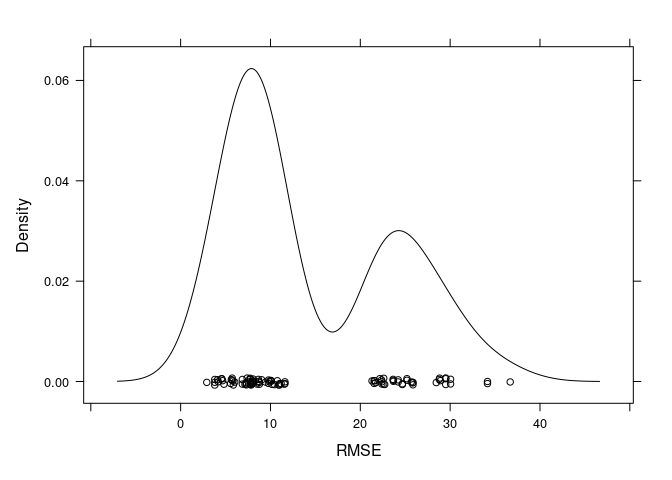<!-- -->

## 3. Appendix: Seperability Analysis of Spectral Bands & Indices

``` r
darkwoods_beetle_spectrals <- read_excel("2.2.darkwoods_beetle_spectral_sampling.xlsx")
describe(darkwoods_beetle_spectrals$NDMI_c)
```

    # A tibble: 1 × 13
       vars     n   mean    sd median trimmed   mad   min   max range  skew kurtosis
      <dbl> <dbl>  <dbl> <dbl>  <dbl>   <dbl> <dbl> <dbl> <dbl> <dbl> <dbl>    <dbl>
    1     1   310 18099. 2323.  17130  17903. 1916. 14171 23740  9569 0.651   -0.673
    # ℹ 1 more variable: se <dbl>

``` r
mean(darkwoods_beetle_spectrals$NDMI_c)
```

    [1] 18099.21

``` r
SD(darkwoods_beetle_spectrals$NDMI_c)
```

    [1] 2323.01

``` r
median(darkwoods_beetle_spectrals$NDMI_c)
```

    [1] 17130

``` r
MeanSE(darkwoods_beetle_spectrals$NDMI_c)
```

    [1] 131.9381

``` r
shapiro.test(darkwoods_beetle_spectrals$NDMI_c)
```


        Shapiro-Wilk normality test

    data:  darkwoods_beetle_spectrals$NDMI_c
    W = 0.92215, p-value = 1.267e-11

``` r
mean(darkwoods_beetle_spectrals$TASWET)
```

    [1] -3829.32

``` r
SD(darkwoods_beetle_spectrals$TASWET)
```

    [1] 426.7044

``` r
median(darkwoods_beetle_spectrals$TASWET)
```

    [1] -3725.465

``` r
MeanSE(darkwoods_beetle_spectrals$TASWET)
```

    [1] 24.23518

``` r
shapiro.test(darkwoods_beetle_spectrals$TASWET)
```


        Shapiro-Wilk normality test

    data:  darkwoods_beetle_spectrals$TASWET
    W = 0.7774, p-value < 2.2e-16

``` r
mean(darkwoods_beetle_spectrals$TASBRI)
```

    [1] 16242.97

``` r
SD(darkwoods_beetle_spectrals$TASBRI)
```

    [1] 624.0056

``` r
median(darkwoods_beetle_spectrals$TASBRI)
```

    [1] 16097.3

``` r
MeanSE(darkwoods_beetle_spectrals$TASBRI)
```

    [1] 35.44114

``` r
shapiro.test(darkwoods_beetle_spectrals$TASBRI)
```


        Shapiro-Wilk normality test

    data:  darkwoods_beetle_spectrals$TASBRI
    W = 0.7639, p-value < 2.2e-16

``` r
mean(darkwoods_beetle_spectrals$TASGRE)
```

    [1] 8447.343

``` r
SD(darkwoods_beetle_spectrals$TASGRE)
```

    [1] 292.6377

``` r
median(darkwoods_beetle_spectrals$TASGRE)
```

    [1] 8364.885

``` r
MeanSE(darkwoods_beetle_spectrals$TASGRE)
```

    [1] 16.6207

``` r
shapiro.test(darkwoods_beetle_spectrals$TASGRE)
```


        Shapiro-Wilk normality test

    data:  darkwoods_beetle_spectrals$TASGRE
    W = 0.72249, p-value < 2.2e-16

``` r
mean(darkwoods_beetle_spectrals$B5NIR)
```

    [1] 11674.51

``` r
SD(darkwoods_beetle_spectrals$B5NIR)
```

    [1] 2238.136

``` r
median(darkwoods_beetle_spectrals$B5NIR)
```

    [1] 10834.5

``` r
MeanSE(darkwoods_beetle_spectrals$B5NIR)
```

    [1] 127.1176

``` r
shapiro.test(darkwoods_beetle_spectrals$B5NIR)
```


        Shapiro-Wilk normality test

    data:  darkwoods_beetle_spectrals$B5NIR
    W = 0.92321, p-value = 1.579e-11

``` r
mean(darkwoods_beetle_spectrals$B1Aerosol)
```

    [1] 8432.161

``` r
SD(darkwoods_beetle_spectrals$B1Aerosol)
```

    [1] 139.8324

``` r
median(darkwoods_beetle_spectrals$B1Aerosol)
```

    [1] 8438

``` r
MeanSE(darkwoods_beetle_spectrals$B1Aerosol)
```

    [1] 7.941949

``` r
shapiro.test(darkwoods_beetle_spectrals$B1Aerosol)
```


        Shapiro-Wilk normality test

    data:  darkwoods_beetle_spectrals$B1Aerosol
    W = 0.90397, p-value = 3.892e-13

``` r
mean(darkwoods_beetle_spectrals$B2Blue)
```

    [1] 7689.177

``` r
SD(darkwoods_beetle_spectrals$B2Blue)
```

    [1] 160.7193

``` r
median(darkwoods_beetle_spectrals$B2Blue)
```

    [1] 7675.5

``` r
MeanSE(darkwoods_beetle_spectrals$B2Blue)
```

    [1] 9.128245

``` r
shapiro.test(darkwoods_beetle_spectrals$B2Blue)
```


        Shapiro-Wilk normality test

    data:  darkwoods_beetle_spectrals$B2Blue
    W = 0.84052, p-value < 2.2e-16

``` r
mean(darkwoods_beetle_spectrals$B7SW2)
```

    [1] 6637.829

``` r
SD(darkwoods_beetle_spectrals$B7SW2)
```

    [1] 706.8761

``` r
median(darkwoods_beetle_spectrals$B7SW2)
```

    [1] 6482.5

``` r
MeanSE(darkwoods_beetle_spectrals$B7SW2)
```

    [1] 40.14787

``` r
shapiro.test(darkwoods_beetle_spectrals$B7SW2)
```


        Shapiro-Wilk normality test

    data:  darkwoods_beetle_spectrals$B7SW2
    W = 0.79745, p-value < 2.2e-16

``` r
mean(darkwoods_beetle_spectrals$B4Red)
```

    [1] 6426.016

``` r
SD(darkwoods_beetle_spectrals$B4Red)
```

    [1] 316.7762

``` r
median(darkwoods_beetle_spectrals$B4Red)
```

    [1] 6341.5

``` r
MeanSE(darkwoods_beetle_spectrals$B4Red)
```

    [1] 17.99168

``` r
shapiro.test(darkwoods_beetle_spectrals$B4Red)
```


        Shapiro-Wilk normality test

    data:  darkwoods_beetle_spectrals$B4Red
    W = 0.72745, p-value < 2.2e-16

``` r
mean(darkwoods_beetle_spectrals$B3Gree)
```

    [1] 7068.503

``` r
SD(darkwoods_beetle_spectrals$B3Gree)
```

    [1] 240.7531

``` r
median(darkwoods_beetle_spectrals$B3Gree)
```

    [1] 6998

``` r
MeanSE(darkwoods_beetle_spectrals$B3Gree)
```

    [1] 13.67386

``` r
shapiro.test(darkwoods_beetle_spectrals$B3Gree)
```


        Shapiro-Wilk normality test

    data:  darkwoods_beetle_spectrals$B3Gree
    W = 0.79389, p-value < 2.2e-16

``` r
wilcox.test(B1Aerosol ~ RA_NonRA, data = darkwoods_beetle_spectrals)
```


        Wilcoxon rank sum test with continuity correction

    data:  B1Aerosol by RA_NonRA
    W = 14350, p-value = 1.69e-05
    alternative hypothesis: true location shift is not equal to 0

``` r
wilcox.test(B2Blue ~ RA_NonRA, data = darkwoods_beetle_spectrals)
```


        Wilcoxon rank sum test with continuity correction

    data:  B2Blue by RA_NonRA
    W = 14342, p-value = 1.778e-05
    alternative hypothesis: true location shift is not equal to 0

``` r
wilcox.test(B3Gree ~ RA_NonRA, data = darkwoods_beetle_spectrals)
```


        Wilcoxon rank sum test with continuity correction

    data:  B3Gree by RA_NonRA
    W = 10832, p-value = 0.7361
    alternative hypothesis: true location shift is not equal to 0

``` r
wilcox.test(B4Red ~ RA_NonRA, data = darkwoods_beetle_spectrals)
```


        Wilcoxon rank sum test with continuity correction

    data:  B4Red by RA_NonRA
    W = 14584, p-value = 3.997e-06
    alternative hypothesis: true location shift is not equal to 0

``` r
wilcox.test(B5NIR ~ RA_NonRA, data = darkwoods_beetle_spectrals)
```


        Wilcoxon rank sum test with continuity correction

    data:  B5NIR by RA_NonRA
    W = 5303.5, p-value = 2.356e-14
    alternative hypothesis: true location shift is not equal to 0

``` r
wilcox.test(B6SW1 ~ RA_NonRA, data = darkwoods_beetle_spectrals)
```


        Wilcoxon rank sum test with continuity correction

    data:  B6SW1 by RA_NonRA
    W = 14818, p-value = 8.676e-07
    alternative hypothesis: true location shift is not equal to 0

``` r
wilcox.test(B7SW2 ~ RA_NonRA, data = darkwoods_beetle_spectrals)
```


        Wilcoxon rank sum test with continuity correction

    data:  B7SW2 by RA_NonRA
    W = 15944, p-value = 1.506e-10
    alternative hypothesis: true location shift is not equal to 0
