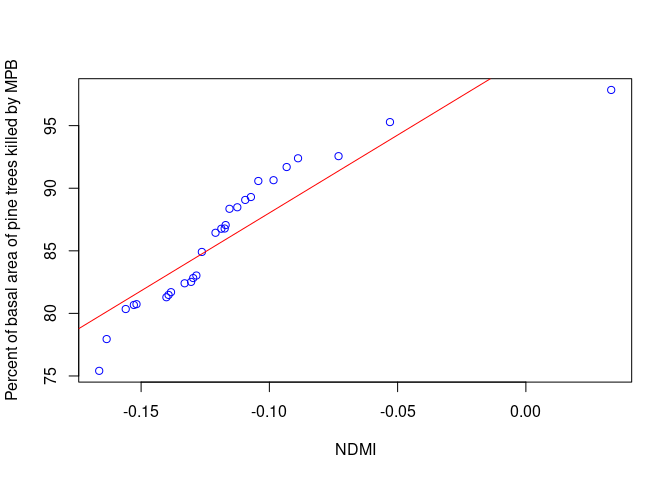
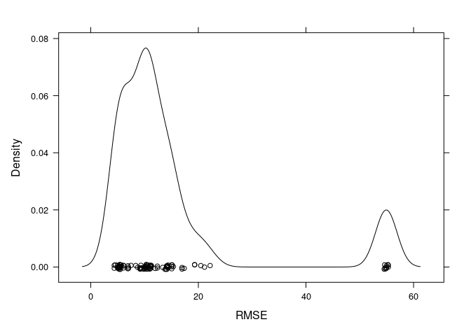
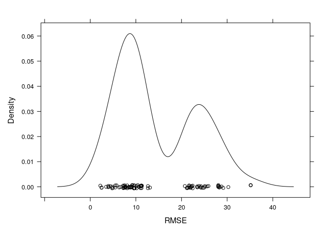
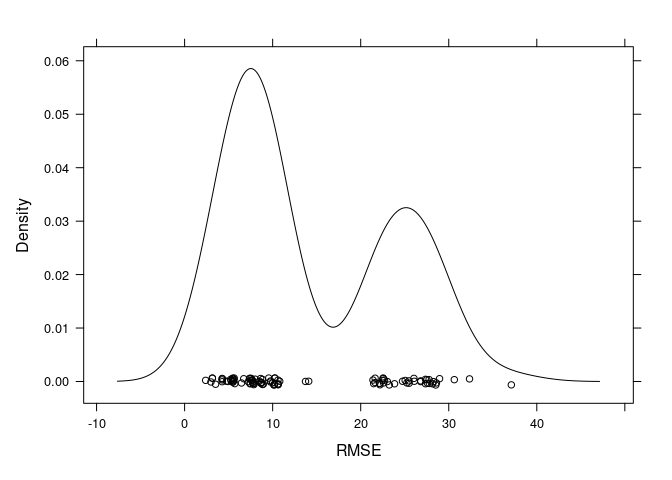
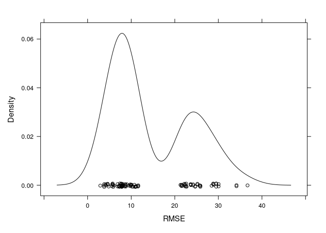

Remote sensing of Mountain pine beetle outbreaks; Darkwoods Conservation
Area
================
SMurphy
2020-11-02

- [1. Model Designs](#1-model-designs)
  - [1.1 Import Data](#11-import-data)
  - [1.2 Model Slope](#12-model-slope)
  - [1.3 Model Training](#13-model-training)
  - [1.4 Model Tuning](#14-model-tuning)
  - [1.5 Model Validation](#15-model-validation)
- [2. Full Model List](#2-full-model-list)
- [3. Appendix: Separability Analysis of Spectral Bands &
  Indices](#3-appendix-separability-analysis-of-spectral-bands--indices)

## 1. Model Designs

### 1.1 Import Data

Set seeds to `123`. Import excel data representing training data of
red-stage beetle attacks from candidate spectral indices sample in-field
in forest health surveys.

``` r
set.seed(123)
darkwoods_beetle_plots_data <- read_excel("2.1.darkwoods_beetle_ground_plots.xlsx")
print(darkwoods_beetle_plots_data)
```

    # A tibble: 28 × 7
        plot pi_mpb_killed pi_mpb_killed_pc   ndmi taswet tasgre tasbri
       <dbl>         <dbl>            <dbl>  <dbl>  <dbl>  <dbl>  <dbl>
     1    26          47.4             75.4 -0.166 -3653.  8290. 15922.
     2    27          44.8             77.9 -0.163 -3627.  8214. 15823.
     3    19          42.3             80.3 -0.156 -4057.  8474. 16402.
     4     2          39.8             80.7 -0.153 -3478.  8063. 15531.
     5     3          37.2             80.7 -0.152 -3576.  8188. 15796.
     6    17          34.7             81.3 -0.140 -4135.  8744. 16855.
     7    20          32.1             81.5 -0.139 -4821.  9452. 18099.
     8    22          29.6             81.7 -0.138 -4460.  8701. 16967.
     9    21          27.1             82.4 -0.133 -4374.  8755. 17018.
    10    18          26.8             82.5 -0.131 -5081.  9102. 17824.
    # ℹ 18 more rows

### 1.2 Model Slope

``` r
beetle_ndmi <- lm(pi_mpb_killed_pc ~ ndmi, data = darkwoods_beetle_plots_data)
beetle_ndmi_residuals <- resid(beetle_ndmi)
summary(beetle_ndmi)
```


    Call:
    lm(formula = pi_mpb_killed_pc ~ ndmi, data = darkwoods_beetle_plots_data)

    Residuals:
        Min      1Q  Median      3Q     Max 
    -6.7582 -1.5253  0.5376  2.0439  3.0846 

    Coefficients:
                Estimate Std. Error t value Pr(>|t|)    
    (Intercept)  100.470      1.431   70.20  < 2e-16 ***
    ndmi         124.421     11.695   10.64 5.75e-11 ***
    ---
    Signif. codes:  0 '***' 0.001 '**' 0.01 '*' 0.05 '.' 0.1 ' ' 1

    Residual standard error: 2.384 on 26 degrees of freedom
    Multiple R-squared:  0.8132,    Adjusted R-squared:  0.806 
    F-statistic: 113.2 on 1 and 26 DF,  p-value: 5.75e-11

``` r
plot(pi_mpb_killed_pc ~ ndmi,
  data = darkwoods_beetle_plots_data,
  main = NULL,
  ylab = "Percent of basal area of pine trees killed by MPB", xlab = "NDMI", col = "blue"
) +
  abline(lm(pi_mpb_killed_pc ~ ndmi, data = darkwoods_beetle_plots_data), col = "red")
```

<!-- -->

    integer(0)

### 1.3 Model Training

Splitting data 70:30 for training samples based on outcome variable:
`pi_mpb_killed_pc`.

``` r
beetle_training.samples <- createDataPartition(darkwoods_beetle_plots_data$pi_mpb_killed, p = 0.70, list = FALSE)
beetle_train.data <- darkwoods_beetle_plots_data[beetle_training.samples, ]
beetle_test.data <- darkwoods_beetle_plots_data[-beetle_training.samples, ]
```

Training regimes set with `time-slice` grid and 10K-fold cross
validation with 10 repeats using `repeatedcv` function.

``` r
model_training_time_series <- trainControl(
  method = "timeslice",
  initialWindow = 36,
  horizon = 12,
  fixedWindow = TRUE
)

model_training_10kfold <- trainControl(
  method = "repeatedcv",
  number = 10, repeats = 10
)
# animation of 10-kfold method:
knitr::include_graphics(path = "animation.gif")
```

<!-- -->

### 1.4 Model Tuning

Models are fitted with support vector machine kernels `svmLinear` &
`svmRadial` and a randomForest regression tree `rf` tuned with 3-step
tuning grid, maximum of 10 hyperparameters, and 1,000 decision branches.
Data was preprocessed using `center` and `scale` functions.

``` r
# model 1 - NDMI - model specification
svm_ndmi_linear <- train(pi_mpb_killed ~ ndmi,
  data = beetle_train.data,
  method = "svmLinear",
  trControl = model_training_10kfold,
  preProcess = c("center", "scale"),
  tuneLength = 10
)

svm_ndmi_radial <- train(pi_mpb_killed ~ ndmi,
  data = beetle_train.data,
  method = "svmRadial",
  trControl = model_training_10kfold,
  preProcess = c("center", "scale"),
  tuneLength = 10
)

rf_ndmi_1000trees <- train(pi_mpb_killed ~ ndmi,
  data = beetle_train.data,
  method = "rf", ntree = 1000,
  metric = "RMSE",
  trControl = model_training_10kfold,
  importance = TRUE
)
```

### 1.5 Model Validation

Following results were used to populate ‘Table 13’ of the current
manuscript, as shown directly below.

|         |             |          |                          |                      |       |       |
|---------|-------------|----------|--------------------------|----------------------|-------|-------|
|         | **R2**      | **RMSE** | **RMSE<sup>ratio</sup>** | **U<sup>bias</sup>** | **C** | **ε** |
| NBR     | 0.879\*\*\* | 1.05     | 0.46                     | 0.035                | 0.316 | 0.10  |
| BAI2-SL | 0.183\*\*\* | 2.61     | 1.09                     | 0.307                | 1.105 | 0.10  |
| MIRBI   | 0.551\*\*\* | 1.94     | 1.16                     | 0.469                | 0.316 | 0.10  |
| TVI     | 0.584\*\*\* | 1.88     | 1.16                     | 0.432                | 0.474 | 0.10  |
| TVI-SW  | 0.241\*\*\* | 2.54     | 1.10                     | 0.343                | 0.158 | 0.10  |

``` r
# model 4 - results
beetle_ndmi_pred_train <- predict(svm_ndmi_linear, data = beetle_train.data)
beetle_ndmi_pred_train_mae <- mae(beetle_ndmi_pred_train, beetle_train.data$pi_mpb_killed)
beetle_ndmi_pred_train_mae
beetle_ndmi_pred_train_mae_rel <- (beetle_ndmi_pred_train_mae / mean(beetle_train.data$pi_mpb_killed)) * 100
beetle_ndmi_pred_train_mae_rel
beetle_ndmi_pred_train_rmse <- rmse(beetle_ndmi_pred_train, beetle_train.data$pi_mpb_killed)
beetle_ndmi_pred_train_rmse
beetle_ndmi_pred_train_rmse_rel <- (beetle_ndmi_pred_train_rmse / mean(beetle_train.data$pi_mpb_killed)) * 100
beetle_ndmi_pred_train_rmse_rel
beetle_ndmi_pred_train_R2 <- R2(beetle_ndmi_pred_train, beetle_train.data$pi_mpb_killed)
beetle_ndmi_pred_train_R2
TheilU(beetle_train.data$pi_mpb_killed, beetle_ndmi_pred_train, type = 2)
beetle_ndmi_pred_train_Ubias <- ((beetle_ndmi_pred_train_mae) * 20) / ((beetle_ndmi_pred_train_mae)^2)
beetle_ndmi_pred_train_Ubias

beetle_ndmi_pred_test <- predict(svm_ndmi_linear, data = darkwoods_beetle_plots_data)
beetle_ndmi_pred_test_rmse <- rmse(beetle_ndmi_pred_test, darkwoods_beetle_plots_data$pi_mpb_killed)
beetle_ndmi_pred_test_rmse / beetle_ndmi_pred_train_rmse
```

## 2. Full Model List

``` r
# model 2 - TAS-WET - model specification
svm_taswet_linear <- train(pi_mpb_killed ~ taswet,
  data = beetle_train.data,
  method = "svmLinear",
  trControl = model_training_10kfold,
  preProcess = c("center", "scale"),
  tuneGrid = expand.grid(C = seq(0, 3, length = 20))
)

# model 3 - TAS-GRE - model specification
svm_tasgreen_linear <- train(pi_mpb_killed ~ tasgre,
  data = beetle_train.data,
  method = "svmLinear",
  trControl = model_training_10kfold,
  preProcess = c("center", "scale"),
  tuneGrid = expand.grid(C = seq(0, 3, length = 20))
)

# model 4 - TAS-BRI - model specification
svm_tasbright_linear <- train(pi_mpb_killed ~ tasbri,
  data = beetle_train.data,
  method = "svmLinear",
  trControl = model_training_10kfold,
  preProcess = c("center", "scale"),
  tuneGrid = expand.grid(C = seq(0, 3, length = 20))
)

# model 1 results
svm_ndmi_linear
```

    Support Vector Machines with Linear Kernel 

    20 samples
     1 predictor

    Pre-processing: centered (1), scaled (1) 
    Resampling: Cross-Validated (10 fold, repeated 10 times) 
    Summary of sample sizes: 18, 18, 18, 18, 18, 18, ... 
    Resampling results:

      RMSE     Rsquared  MAE    
      14.7918  1         12.8896

    Tuning parameter 'C' was held constant at a value of 1

``` r
svm_ndmi_linear$finalModel
```

    Support Vector Machine object of class "ksvm" 

    SV type: eps-svr  (regression) 
     parameter : epsilon = 0.1  cost C = 1 

    Linear (vanilla) kernel function. 

    Number of Support Vectors : 20 

    Objective Function Value : -9.2667 
    Training error : 0.876724 

``` r
trellis.par.set(caretTheme())
densityplot(svm_ndmi_linear)

# model 2 results
svm_taswet_linear$finalModel
```

    Support Vector Machine object of class "ksvm" 

    SV type: eps-svr  (regression) 
     parameter : epsilon = 0.1  cost C = 1.26315789473684 

    Linear (vanilla) kernel function. 

    Number of Support Vectors : 19 

    Objective Function Value : -16.603 
    Training error : 1.103527 

``` r
trellis.par.set(caretTheme())
densityplot(svm_taswet_linear)

# model 3 results
svm_tasgreen_linear
```

    Support Vector Machines with Linear Kernel 

    20 samples
     1 predictor

    Pre-processing: centered (1), scaled (1) 
    Resampling: Cross-Validated (10 fold, repeated 10 times) 
    Summary of sample sizes: 18, 18, 18, 18, 18, 18, ... 
    Resampling results across tuning parameters:

      C          RMSE      Rsquared  MAE     
      0.0000000       NaN  NaN            NaN
      0.1578947  14.81055    1       12.88699
      0.3157895  14.66764    1       12.79469
      0.4736842  14.60755    1       12.74808
      0.6315789  14.56003    1       12.72289
      0.7894737  14.47601    1       12.66325
      0.9473684  14.46474    1       12.62098
      1.1052632  14.44848    1       12.59831
      1.2631579  14.44000    1       12.58536
      1.4210526  14.43257    1       12.57673
      1.5789474  14.43082    1       12.57485
      1.7368421  14.42996    1       12.57169
      1.8947368  14.42620    1       12.56361
      2.0526316  14.41957    1       12.55650
      2.2105263  14.42045    1       12.54937
      2.3684211  14.40999    1       12.53383
      2.5263158  14.41096    1       12.53437
      2.6842105  14.41146    1       12.53404
      2.8421053  14.41318    1       12.53438
      3.0000000  14.41287    1       12.53382

    RMSE was used to select the optimal model using the smallest value.
    The final value used for the model was C = 2.368421.

``` r
svm_tasgreen_linear$finalModel
```

    Support Vector Machine object of class "ksvm" 

    SV type: eps-svr  (regression) 
     parameter : epsilon = 0.1  cost C = 2.36842105263158 

    Linear (vanilla) kernel function. 

    Number of Support Vectors : 19 

    Objective Function Value : -31.0799 
    Training error : 1.131827 

``` r
trellis.par.set(caretTheme())
densityplot(svm_tasgreen_linear)

# model 4 results
svm_tasbright_linear
```

    Support Vector Machines with Linear Kernel 

    20 samples
     1 predictor

    Pre-processing: centered (1), scaled (1) 
    Resampling: Cross-Validated (10 fold, repeated 10 times) 
    Summary of sample sizes: 18, 18, 18, 18, 18, 18, ... 
    Resampling results across tuning parameters:

      C          RMSE      Rsquared  MAE     
      0.0000000       NaN  NaN            NaN
      0.1578947  14.60487    1       13.07723
      0.3157895  14.51137    1       13.03732
      0.4736842  14.47029    1       13.00260
      0.6315789  14.45903    1       12.97040
      0.7894737  14.46214    1       12.95190
      0.9473684  14.47403    1       12.96633
      1.1052632  14.47228    1       12.96696
      1.2631579  14.47087    1       12.96006
      1.4210526  14.47802    1       12.96429
      1.5789474  14.47907    1       12.95929
      1.7368421  14.48107    1       12.96214
      1.8947368  14.48548    1       12.96643
      2.0526316  14.48540    1       12.96876
      2.2105263  14.48361    1       12.96639
      2.3684211  14.47465    1       12.96399
      2.5263158  14.47036    1       12.96158
      2.6842105  14.46768    1       12.95914
      2.8421053  14.46356    1       12.95672
      3.0000000  14.46132    1       12.95451

    RMSE was used to select the optimal model using the smallest value.
    The final value used for the model was C = 0.6315789.

``` r
svm_tasbright_linear$finalModel
```

    Support Vector Machine object of class "ksvm" 

    SV type: eps-svr  (regression) 
     parameter : epsilon = 0.1  cost C = 0.631578947368421 

    Linear (vanilla) kernel function. 

    Number of Support Vectors : 19 

    Objective Function Value : -8.4089 
    Training error : 1.120976 

``` r
trellis.par.set(caretTheme())
densityplot(svm_tasbright_linear)
```



## 3. Appendix: Separability Analysis of Spectral Bands & Indices

Following code chunk was used to populate ‘Table 11’ and ‘Table 12’ of
the current manuscript, as shown directly below.

|                                      |           |          |           |          |                       |                    |
|--------------------------------------|-----------|----------|-----------|----------|-----------------------|--------------------|
| **Spectral wavelength<sup>nm</sup>** | **M**     | **SD**   | **Mdn**   | **SE**   | **Mdist<sup>W</sup>** | **SW<sup>p</sup>** |
| NIR                                  | 11674.510 | 2238.136 | 10834.500 | 127.118  | 1.135\*\*\*           | 0.923\*\*\*        |
| Aerosol                              | 8432.161  | 139.832  | 8438.000  | 7.942    | 0.296\*\*\*           | 0.904\*\*\*        |
| Blue                                 | 7689.177  | 160.719  | 7675.500  | 9.128245 | 0.294\*\*\*           | 0.841\*\*\*        |
| SWIR2                                | 6637.829  | 706.8761 | 6482.500  | 40.14787 | 0.284\*\*\*           | 0.797\*\*\*        |
| Red                                  | 6426.016  | 316.7762 | 6341.5    | 17.99168 | 0.197\*\*\*           | 0.727\*\*\*        |
| Green                                | 7068.503  | 240.7531 | 6998.000  | 13.67386 | 0.011                 | 0.794\*\*\*        |
| **Spectral index<sup>nm</sup>**      |           |          |           |          |                       |                    |
| NDMI                                 | 0.5836    | 0.144    | 0.551     | 0.027    | 1.004                 | 0.943              |
| TAS-Wet                              | -4013.162 | 399.494  | -3911.261 | 75.497   | 0.240\*\*\*           | 0.904\*\*          |
| TAS-Bright                           | 16470.480 | 616.788  | 16354.130 | 116.562  | 0.171\*\*\*           | 0.917\*            |
| TAS-Green                            | 8528.016  | 299.830  | 8474.081  | 56.663   | 0.092                 | 0.906\*            |

``` r
darkwoods_beetle_spectrals <- read_excel("2.2.darkwoods_beetle_spectral_sampling.xlsx")
describe(darkwoods_beetle_spectrals$NDMI_c)
mean(darkwoods_beetle_spectrals$NDMI_c)
SD(darkwoods_beetle_spectrals$NDMI_c)
median(darkwoods_beetle_spectrals$NDMI_c)
MeanSE(darkwoods_beetle_spectrals$NDMI_c)
shapiro.test(darkwoods_beetle_spectrals$NDMI_c)

mean(darkwoods_beetle_spectrals$TASWET)
SD(darkwoods_beetle_spectrals$TASWET)
median(darkwoods_beetle_spectrals$TASWET)
MeanSE(darkwoods_beetle_spectrals$TASWET)
shapiro.test(darkwoods_beetle_spectrals$TASWET)

mean(darkwoods_beetle_spectrals$TASBRI)
SD(darkwoods_beetle_spectrals$TASBRI)
median(darkwoods_beetle_spectrals$TASBRI)
MeanSE(darkwoods_beetle_spectrals$TASBRI)
shapiro.test(darkwoods_beetle_spectrals$TASBRI)

mean(darkwoods_beetle_spectrals$TASGRE)
SD(darkwoods_beetle_spectrals$TASGRE)
median(darkwoods_beetle_spectrals$TASGRE)
MeanSE(darkwoods_beetle_spectrals$TASGRE)
shapiro.test(darkwoods_beetle_spectrals$TASGRE)

mean(darkwoods_beetle_spectrals$B5NIR)
SD(darkwoods_beetle_spectrals$B5NIR)
median(darkwoods_beetle_spectrals$B5NIR)
MeanSE(darkwoods_beetle_spectrals$B5NIR)
shapiro.test(darkwoods_beetle_spectrals$B5NIR)

mean(darkwoods_beetle_spectrals$B1Aerosol)
SD(darkwoods_beetle_spectrals$B1Aerosol)
median(darkwoods_beetle_spectrals$B1Aerosol)
MeanSE(darkwoods_beetle_spectrals$B1Aerosol)
shapiro.test(darkwoods_beetle_spectrals$B1Aerosol)

mean(darkwoods_beetle_spectrals$B2Blue)
SD(darkwoods_beetle_spectrals$B2Blue)
median(darkwoods_beetle_spectrals$B2Blue)
MeanSE(darkwoods_beetle_spectrals$B2Blue)
shapiro.test(darkwoods_beetle_spectrals$B2Blue)

mean(darkwoods_beetle_spectrals$B7SW2)
SD(darkwoods_beetle_spectrals$B7SW2)
median(darkwoods_beetle_spectrals$B7SW2)
MeanSE(darkwoods_beetle_spectrals$B7SW2)
shapiro.test(darkwoods_beetle_spectrals$B7SW2)

mean(darkwoods_beetle_spectrals$B4Red)
SD(darkwoods_beetle_spectrals$B4Red)
median(darkwoods_beetle_spectrals$B4Red)
MeanSE(darkwoods_beetle_spectrals$B4Red)
shapiro.test(darkwoods_beetle_spectrals$B4Red)

mean(darkwoods_beetle_spectrals$B3Gree)
SD(darkwoods_beetle_spectrals$B3Gree)
median(darkwoods_beetle_spectrals$B3Gree)
MeanSE(darkwoods_beetle_spectrals$B3Gree)
shapiro.test(darkwoods_beetle_spectrals$B3Gree)

wilcox.test(B1Aerosol ~ RA_NonRA, data = darkwoods_beetle_spectrals)
wilcox.test(B2Blue ~ RA_NonRA, data = darkwoods_beetle_spectrals)
wilcox.test(B3Gree ~ RA_NonRA, data = darkwoods_beetle_spectrals)
wilcox.test(B4Red ~ RA_NonRA, data = darkwoods_beetle_spectrals)
wilcox.test(B5NIR ~ RA_NonRA, data = darkwoods_beetle_spectrals)
wilcox.test(B6SW1 ~ RA_NonRA, data = darkwoods_beetle_spectrals)
wilcox.test(B7SW2 ~ RA_NonRA, data = darkwoods_beetle_spectrals)
```
